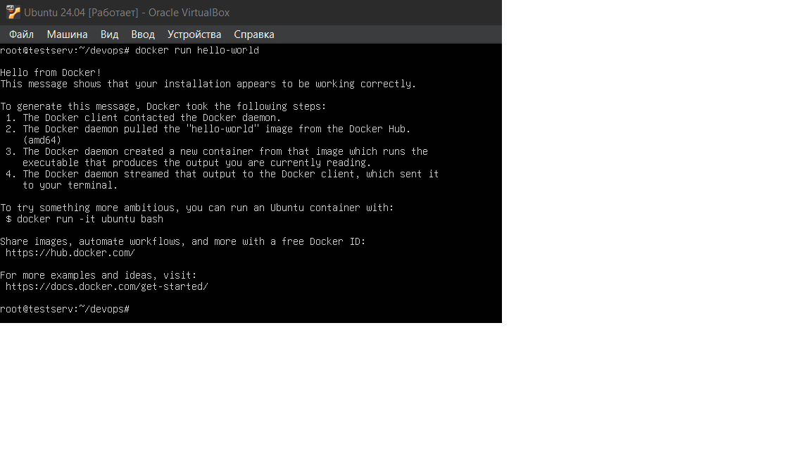
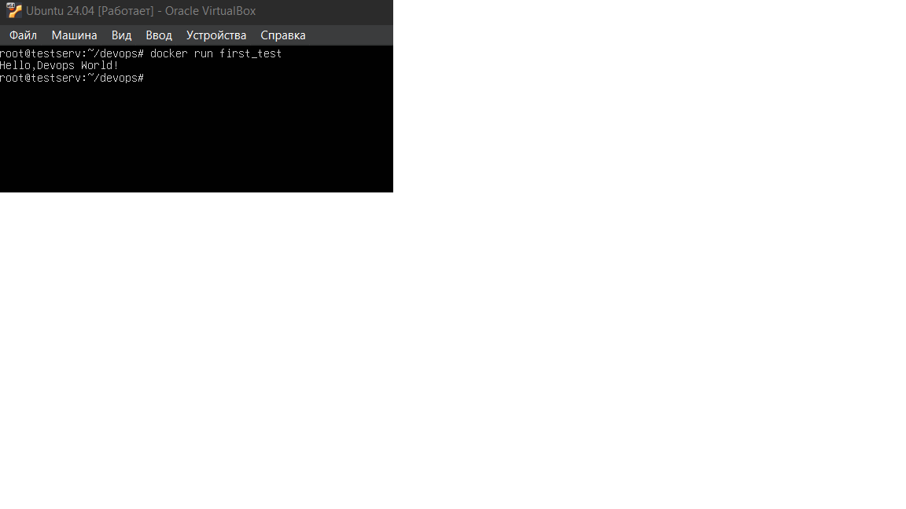

# my-first-devops

 

## Отчет о проделанном задании

### Установка Git: 
Мною был скачан Git-2.53.0 с официального сайта, после выбора всех 
пунктов во время установки, я запустил само приложение, проверил 
работоспособность с помощью команды git --version. Далее, я создал 
ssh-ключи при помощи команды ssh-keygen -t ed25519 -C "email" которую я 
скопировал с сайта-инструкции. Аккаунт на Github у меня уже был, я 
вручную на сайте сделал репозиторий,при создании сразу создал 
README.Репозиторий впоследствии скопировал при помощи команды git clone 
(url-ссылка на репо).
### Установка Docker:
Docker desktop для Windows также был установлен с официального сайта, 
однако, у меня возникли проблемы с его использованием(мне долгое время 
не удается побороть WSL), из-за чего, я установил docker на виртуальную 
машину Ubuntu, и задачу решал там.
